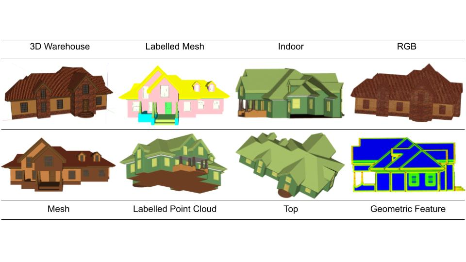
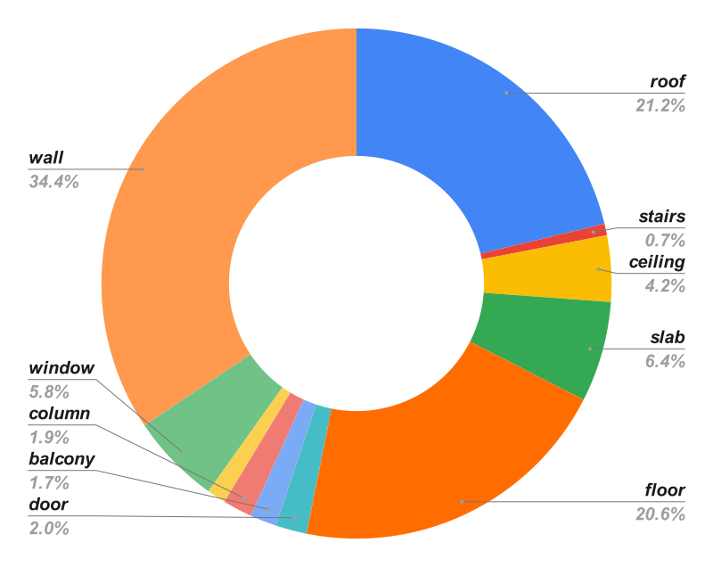

# Introduction

To perform effectively, machine learning (ML) and deep learning (DL) algorithms require high-quality training samples and accurate and detailed annotations. We describe a semi-automatic framework for creating a dataset and establish a canonical benchmark dataset, the 3D building indoor outdoor dataset (BIO dataset), which is a highly accurate, high level of detail, and high coverage dataset for 3D building point cloud and mesh semantic segmentation. According to statistics, the total area of this dataset is 481,769 square metres, with an average of 75,587 triangular faces per building, and contains 11 building structure semantic categories.

----

## Some examples of our dataset:

----

## Statistics of BIO dataset:

----

[Download the paper](https://docs.github.com/en/pages/setting-up-a-github-pages-site-with-jekyll/creating-a-github-pages-site-with-jekyll#creating-your-site).

*Download the dataset* The official implementation will soon be published in [our github repository](). Please fill in [this form](https://docs.google.com/forms/d/e/1FAIpQLSddsRsn_M-J4e_HnkN2n5Sy8L6xyRV7BX9y38C7ev8OLFZXsg/viewform?usp=sf_link), in order to get access to the official release of the BIO dataset.

----

### Bibtex
[BIO Dataset A 3D Building Indoor Outdoor Semantic Segmentation Benchmark]

----

### Contributing

When contributing to this repository, please first discuss the change you wish to make via issue,
email, or any other method with the owners of this repository before making a change. Read more about becoming a contributor in [our GitHub repo](https://github.com/biodatset/biodataset/#contributing).

----

### License

Just the Docs is distributed by an [MIT license](https://github.com/biodatset/biodataset/tree/main/LICENSE.txt).
